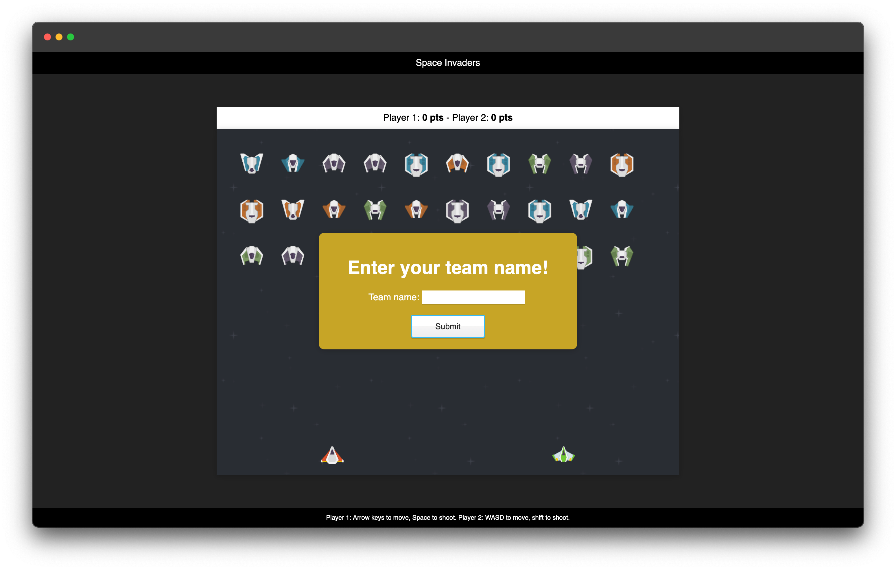

<h1 align="left">Space Invaders</h1>

<!--   -->

A fun two-player Space Invaders close I built using JavaScript, HTML, CSS, SCSS, and Firebase. 

Head over to https://space-invaders.lukegrippa.com to check it out and see if you can get a new high score!

<h2 align="left">Controls: </h2>

Player 1:
- Arrow keys to move
- Space bar to shoot

Player 2:
- WASD to move
- Shift to shoot

<h2 align="left">Tech Used: </h2>

- JavaScript
- HTML
- CSS
- SCSS
- Firebase

<h2 align="left">Contact: </h2>

me@lukegrippa.com

Project Link: https://space-invaders.lukegrippa.com

Let me know if you have any feedback or ideas for the game. Leave a ⭐  if you like it!